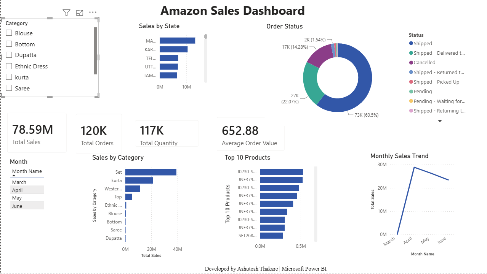

# 📊 Amazon Sales Dashboard | Power BI

## 📌 Project Overview

This project is an interactive Amazon Sales Dashboard built using Microsoft Power BI to analyze sales performance and generate business insights.

---

## 🚀 Features

- Interactive KPI Cards
- Monthly Sales Trend
- Sales by Category
- Top 10 Products
- Sales by State
- Order Status Analysis
- Interactive Slicers

---

## 🛠 Tools & Technologies

- Microsoft Power BI
- Power Query
- DAX
- Data Modeling

---

## 📈 DAX Measures

- Total Sales
- Total Orders
- Total Quantity
- Average Order Value

---

## 📷 Dashboard Preview

---

## 📊 Dashboard Insights

- Identified top-selling product categories.
- Analyzed monthly sales trends.
- Compared sales across different states.
- Tracked order status distribution.
- Identified top-performing products.

---

## 👨‍💻 Developed By

**Ashutosh Thakare**
